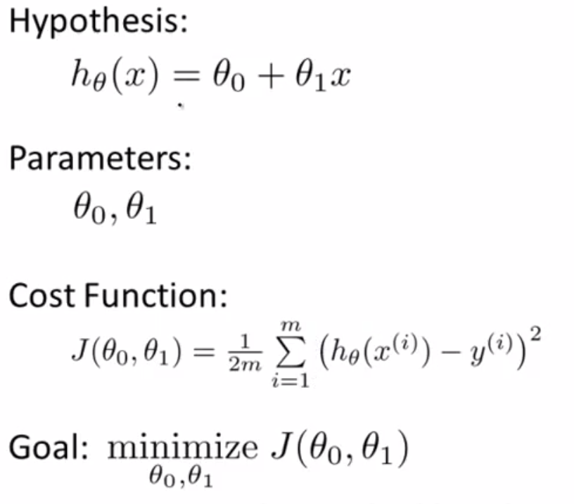

# Andrew Ng
https://www.coursera.org/learn/machine-learning


# Supervised Learning
In supervised learning, we are given a data set and already know what our correct output should look like.

## Linear Regression
map input variables to some continuous function


### Hypothesis Function


Vector:
```
H(x) = X * θ'
```

### Cost Function
https://www.coursera.org/learn/machine-learning/supplement/nhzyF/cost-function

https://www.coursera.org/learn/machine-learning/supplement/u3qF5/cost-function-intuition-i

https://www.coursera.org/learn/machine-learning/supplement/9SEeJ/cost-function-intuition-ii

Vector:
```
h = X * theta;
J = (1 / (2*m)) * sum((h - y) .^ 2);
# J = (1/(2*m)) * ((h-y)' * (h - y));
```

### Gradient Descent
https://www.coursera.org/learn/machine-learning/supplement/QKEdR/gradient-descent-intuition

https://www.coursera.org/learn/machine-learning/supplement/U90DX/gradient-descent-for-linear-regression

https://www.coursera.org/learn/machine-learning/supplement/aEN5G/gradient-descent-for-multiple-variables

##### Feature Scaling
https://www.coursera.org/learn/machine-learning/supplement/CTA0D/gradient-descent-in-practice-i-feature-scaling

##### Learning Rate
https://www.coursera.org/learn/machine-learning/supplement/TnHvV/gradient-descent-in-practice-ii-learning-rate

Vector:
```
h = X * theta;
theta = theta - X' * ((alpha / m) * (h - y));
grad = (1.0 ./ m) * X' * (h - y)
```

## Normal Equation

https://www.coursera.org/learn/machine-learning/supplement/bjjZW/normal-equation

### Compaire
With the normal equation, computing the inversion has complexity O(n3). So if we have a very large number of features, the normal equation will be slow. In practice, when n exceeds 10,000 it might be a good time to go from a normal solution to an iterative process.

## Classification (Logistic Regression / Sigmoid Function)
map input variables into discrete categories.

### Hypothesis Function
https://www.coursera.org/learn/machine-learning/supplement/AqSH6/hypothesis-representation


### Decision Boundary
https://www.coursera.org/learn/machine-learning/supplement/N8qsm/decision-boundary

### Cost Function
https://www.coursera.org/learn/machine-learning/supplement/bgEt4/cost-function

### Gradient Descent
https://www.coursera.org/learn/machine-learning/supplement/HuE6M/multiclass-classification-one-vs-all

## Overfitting

https://www.coursera.org/learn/machine-learning/supplement/VTe37/the-problem-of-overfitting

### Cost Function

https://www.coursera.org/learn/machine-learning/supplement/1tJlY/cost-function

### Linear
https://www.coursera.org/learn/machine-learning/supplement/pKAsc/regularized-linear-regression

```
grad = 1.0 / m * X' * (h -y) + lambda / m * ([0;theta(2:end,:)]);
```

### Logistic

https://www.coursera.org/learn/machine-learning/supplement/v51eg/regularized-logistic-regression

## Classification (Nature Network)

simple logistic regression together with adding in maybe the quadratic or the cubic features - that's just not a good way to learn complex nonlinear hypotheses when n is large because you just end up with too many features. In the next few videos, I would like to tell you about Neural Networks, which turns out to be a much better way to learn complex hypotheses, complex nonlinear hypotheses even when your input feature space, even when n is large(因此 只是简单的增加 二次项或者三次项 之类的逻辑回归算法 并不是一个解决 复杂非线性问题的好办法 因为当n很大时 将会产生非常多的特征项 在接下来的视频课程中 我将为大家讲解神经网络 它在解决复杂的非线性分类问题上 被证明是 是一种好得多的算法 即使你输入特征空间 或输入的特征维数n很大也能轻松搞定)

### Model (Hypothesis Function)
https://www.coursera.org/learn/machine-learning/supplement/Bln5m/model-representation-i

https://www.coursera.org/learn/machine-learning/supplement/YlEVx/model-representation-ii

### Cost Function
https://www.coursera.org/learn/machine-learning/supplement/afqGa/cost-function

### Backpropagation 
https://zh.wikipedia.org/wiki/%E5%8F%8D%E5%90%91%E4%BC%A0%E6%92%AD%E7%AE%97%E6%B3%95

https://www.zhihu.com/question/27239198

https://mattmazur.com/2015/03/17/a-step-by-step-backpropagation-example/

https://www.cnblogs.com/charlotte77/p/5629865.html

# Advice for Applying Machine Learning

## Model Selection

https://www.coursera.org/learn/machine-learning/supplement/aFpD3/evaluating-a-hypothesis

https://www.coursera.org/learn/machine-learning/supplement/XHQqO/model-selection-and-train-validation-test-sets

break down our dataset into the three sets:
Training set: 60%
Cross validation set: 20%
Test set: 20%

## Bias vs. Variance

### high bias
Low training set size: causes Jtrain(Θ) to be low and JCV(Θ) to be high.

Large training set size: causes both Jtrain(Θ) and JCV(Θ) to be high with Jtrain(Θ)≈JCV(Θ).

If a learning algorithm is suffering from high bias, getting more training data will not (by itself) help much.

### high variance

Low training set size: Jtrain(Θ) will be low and JCV(Θ) will be high.

Large training set size: Jtrain(Θ) increases with training set size and JCV(Θ) continues to decrease without leveling off. Also, Jtrain(Θ) < JCV(Θ) but the difference between them remains significant.

If a learning algorithm is suffering from high variance, getting more training data is likely to help.

## Prioritizing What to Work On

https://www.coursera.org/learn/machine-learning/supplement/0uu7a/prioritizing-what-to-work-on

1. Collect lots of data
2. Develop sophisticated features
3. Develop algorithms to process your input in different ways

## Error Analysis
https://www.coursera.org/learn/machine-learning/supplement/Z11RP/error-analysis

1. Start with a simple algorithm, implement it quickly, and test it early on your cross validation data.
2. Plot learning curves to decide if more data, more features, etc. are likely to help.
3. Manually examine the errors on examples in the cross validation set and try to spot a trend where most of the errors were made

## Skewed Classes

# Support Vector Machines(支持向量机,SVM)
1. Large Margin Classification
2. Kernels

# Unsupervised Learning
Unsupervised learning allows us to approach problems with little or no idea what our results should look like

1. K-Means
2. PCA(Principal Component Analysis)
3. Anomaly detection
4. Recommender Systemss