# Andrew Ng
https://www.coursera.org/learn/machine-learning


# Supervised Learning
In supervised learning, we are given a data set and already know what our correct output should look like.

## Linear Regression
map input variables to some continuous function


### Hypothesis Function


Vector:
```
H(x) = X * θ'
```

### Cost Function


Vector:
```
h = X * theta;
J = (1 / (2*m)) * sum((h - y) .^ 2);
# J = (1/(2*m)) * ((h-y)' * (h - y));
```

### Gradient Descent


Vector:
```
h = X * theta;
theta = theta - X' * ((alpha / m) * (h - y));
grad = (1.0 ./ m) * X' * (h - y)
```

## Normal Equation


## Classification
map input variables into discrete categories.

### Hypothesis Function


### Decision Boundary
```
h(x) = g(z)
z > 0
Xθ > 0
```


### Cost Function


### Gradient Descent


## Overfitting

### Linear
Cost Function:


Gradient Descent:

```
grad = 1.0 / m * X' * (h -y) + lambda / m * ([0;theta(2:end,:)]);
```

Normal Equation:


### Logistic

Cost Function:


Gradient Descent:


# Neural Networks
Flow:

Theta:

Flow:

Theta:


## Backpropagation 
https://zh.wikipedia.org/wiki/%E5%8F%8D%E5%90%91%E4%BC%A0%E6%92%AD%E7%AE%97%E6%B3%95
https://mattmazur.com/2015/03/17/a-step-by-step-backpropagation-example/

# Advice for Applying Machine Learning

## Model Selection
break down our dataset into the three sets:
Training set: 60%
Cross validation set: 20%
Test set: 20%
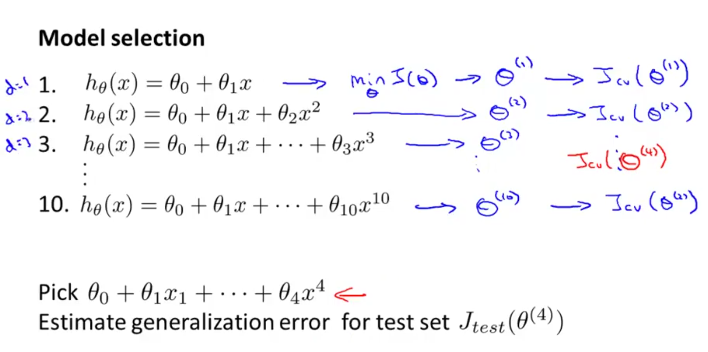
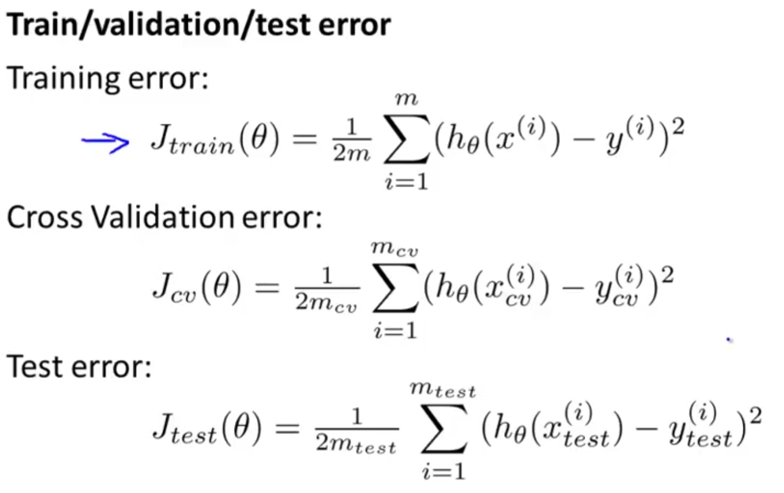

For Regularization:
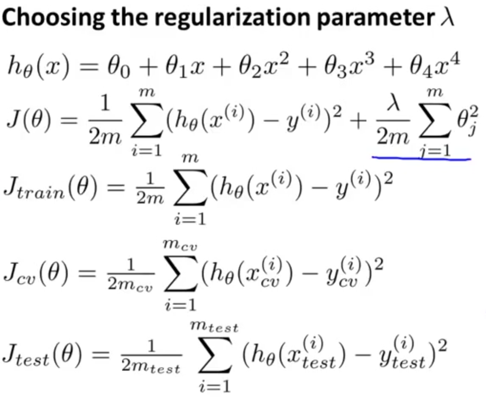

## Bias vs. Variance

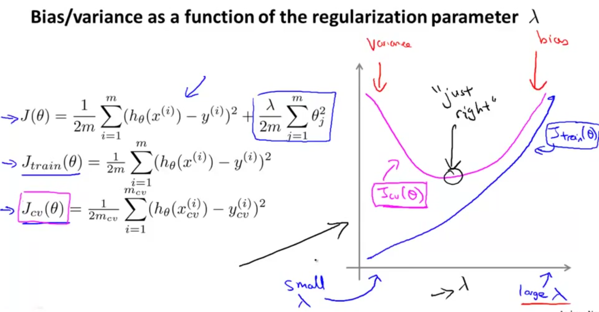

### high bias
Low training set size: causes Jtrain(Θ) to be low and JCV(Θ) to be high.

Large training set size: causes both Jtrain(Θ) and JCV(Θ) to be high with Jtrain(Θ)≈JCV(Θ).

If a learning algorithm is suffering from high bias, getting more training data will not (by itself) help much.


### high variance

Low training set size: Jtrain(Θ) will be low and JCV(Θ) will be high.

Large training set size: Jtrain(Θ) increases with training set size and JCV(Θ) continues to decrease without leveling off. Also, Jtrain(Θ) < JCV(Θ) but the difference between them remains significant.

If a learning algorithm is suffering from high variance, getting more training data is likely to help.


## kernel
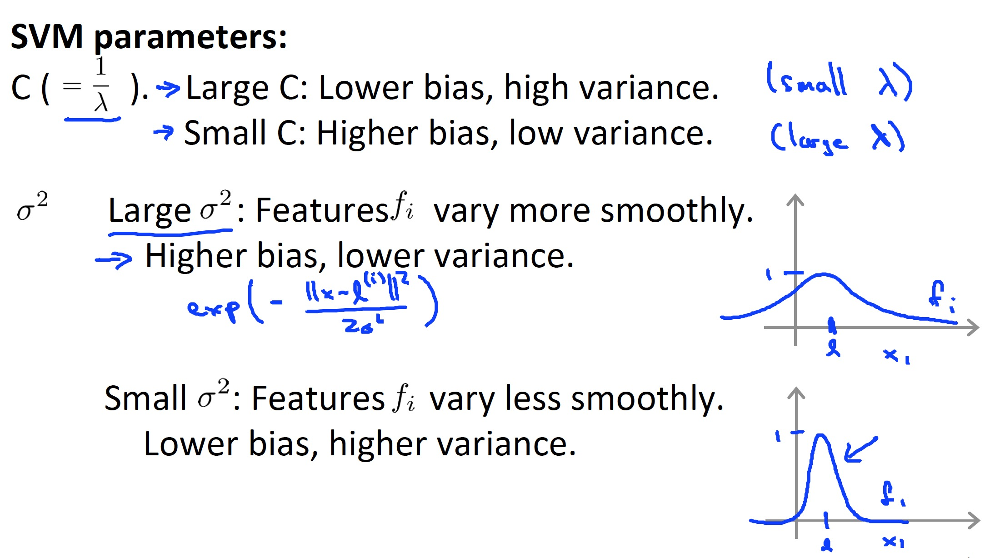
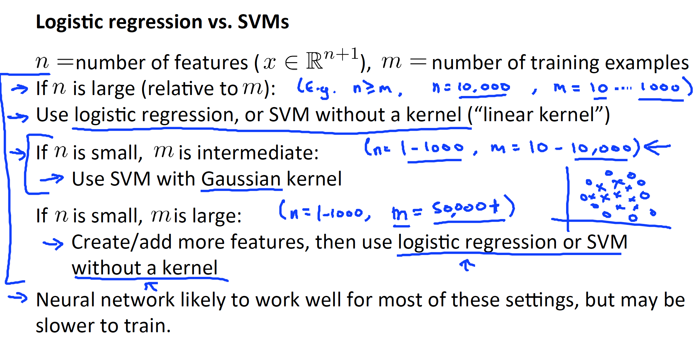

# Unsupervised Learning
Unsupervised learning allows us to approach problems with little or no idea what our results should look like

## K-Means


## PCA(Principal Component Analysis)
Compression:
Reduce memory/disk needed to store data
Speed up learning algorithm
Visualiza1on(2D/3D)

### covariance matrix
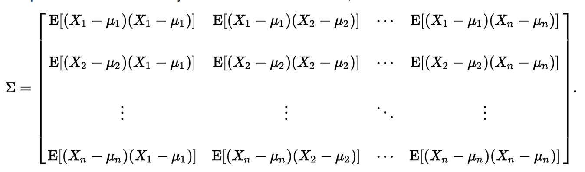

## Anomaly detection
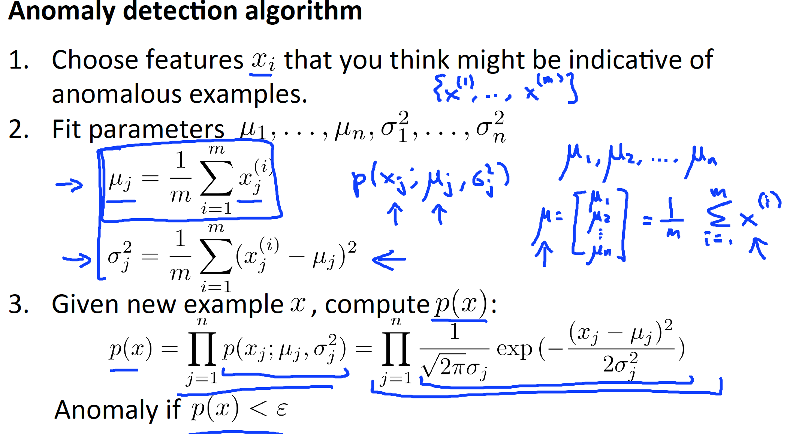
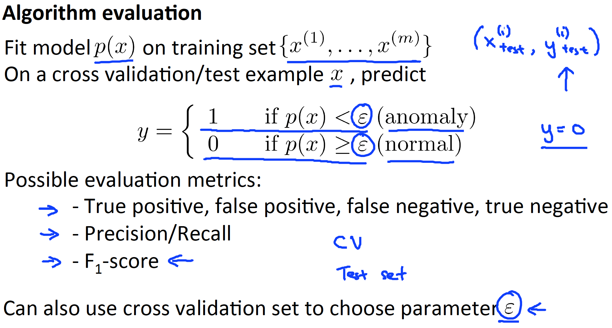
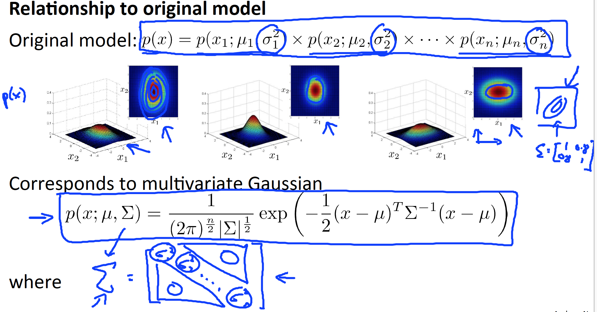

## Recommender Systems
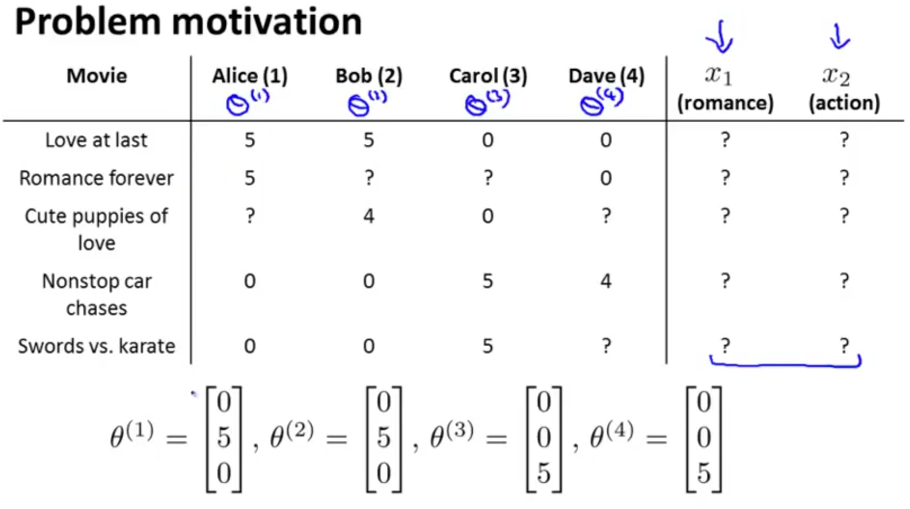
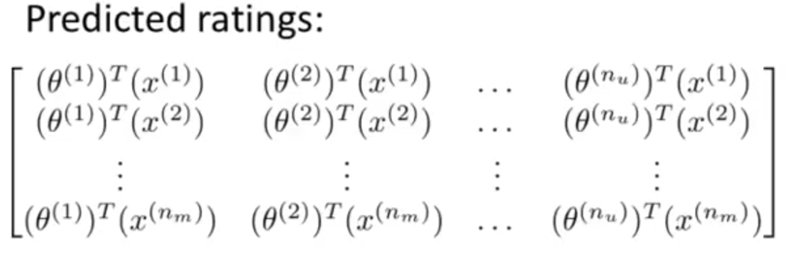

## Summary
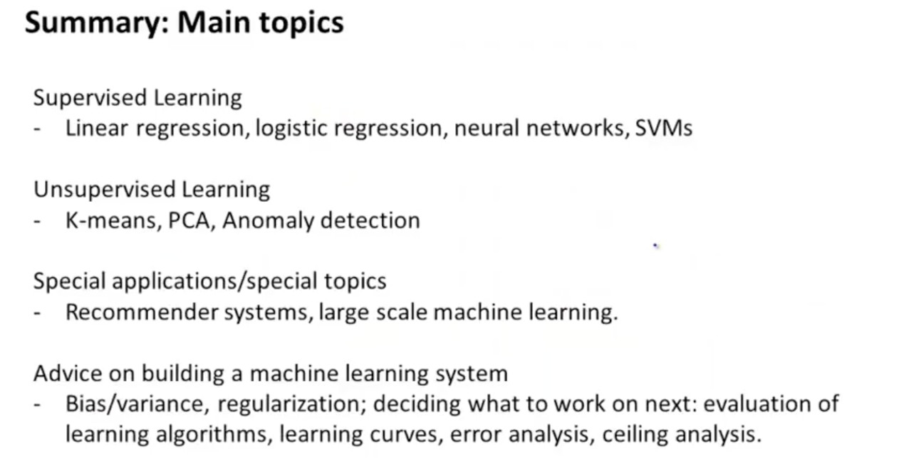


