# Andrew Ng
https://www.coursera.org/learn/machine-learning

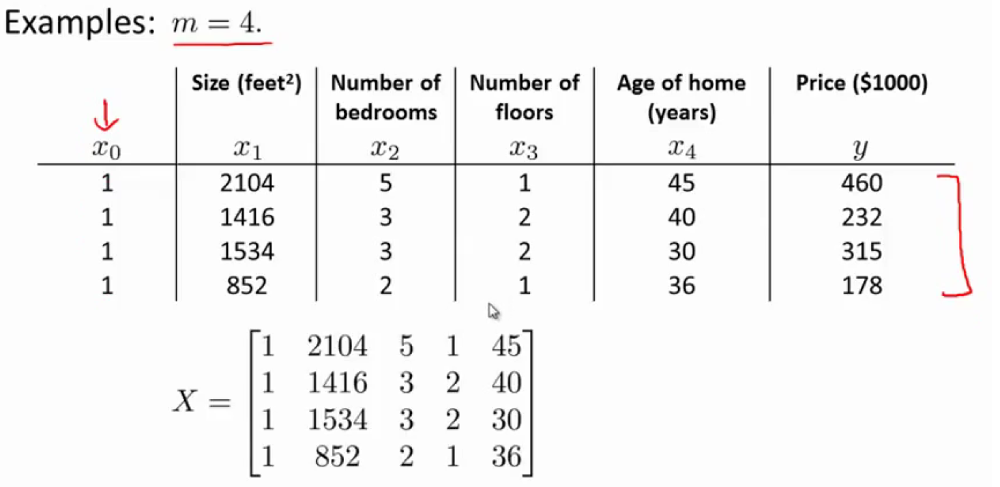

# Supervised Learning
In supervised learning, we are given a data set and already know what our correct output should look like.

## Linear Regression
map input variables to some continuous function

### Hypothesis Function
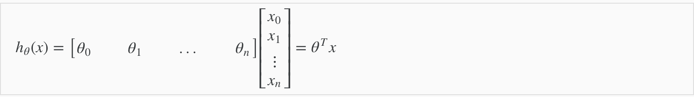

Vector:
```
H(x) = X * θ'
```

### Cost Function
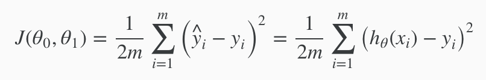


Vector:
```
h = X * theta;
J = (1 / (2*m)) * sum((h - y) .^ 2);
# J = (1/(2*m)) * ((h-y)' * (h - y));
```

### Gradient Descent


Vector:
```
h = X * theta;
theta = theta - X' * ((alpha / m) * (h - y));
grad = (1.0 ./ m) * X' * (h - y)
```

## Normal Equation
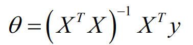
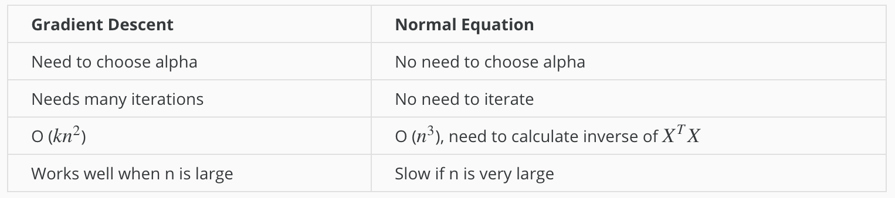


## Classification
map input variables into discrete categories.

### Hypothesis Function
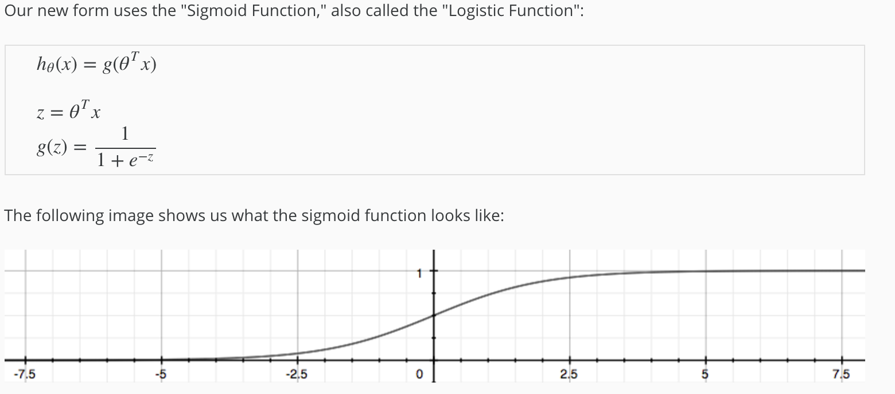

### Decision Boundary
```
h(x) = g(z)
z > 0
Xθ > 0
```
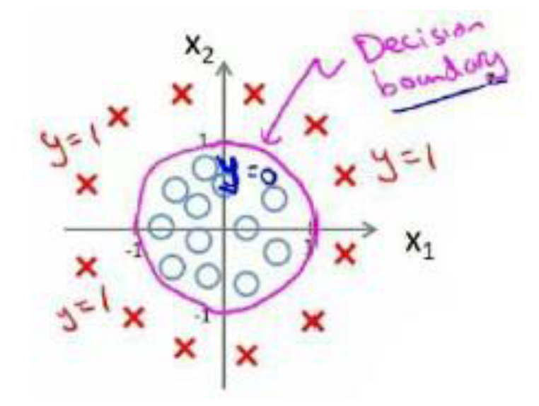

### Cost Function
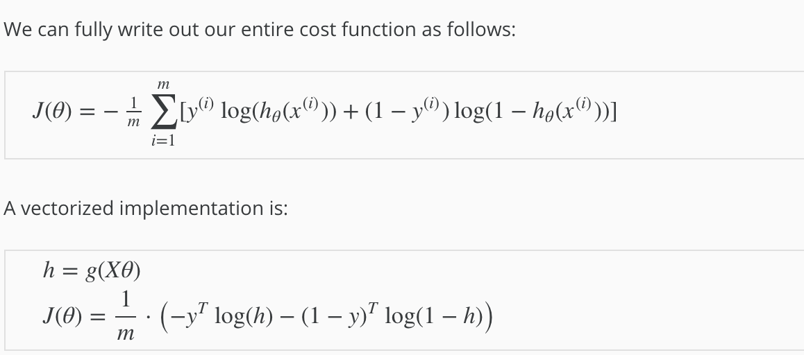

### Gradient Descent
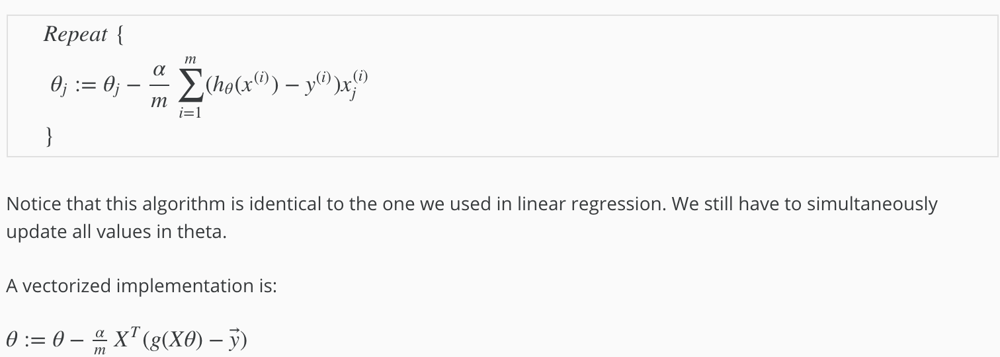

## Overfitting

### Linear
Cost Function:
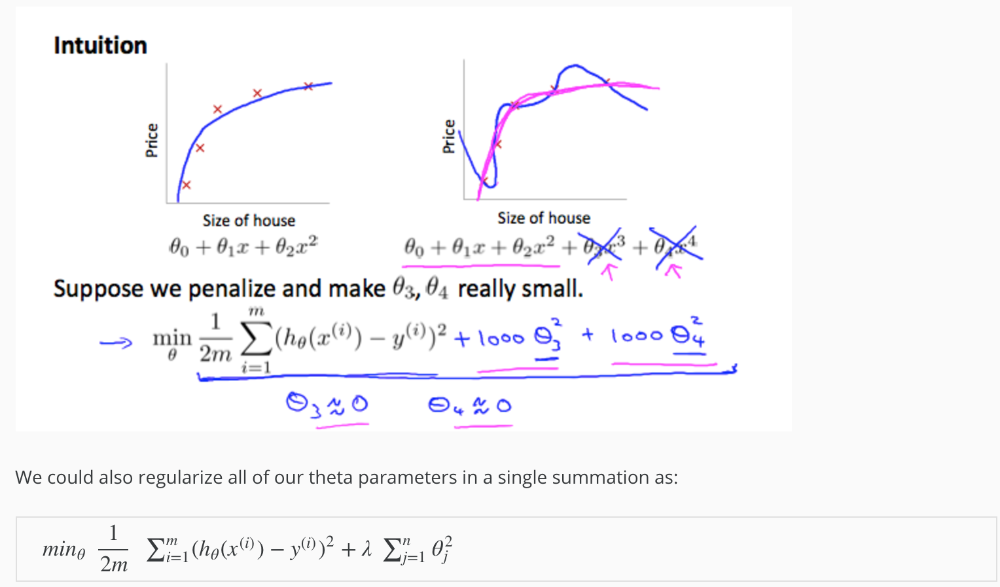

Gradient Descent:
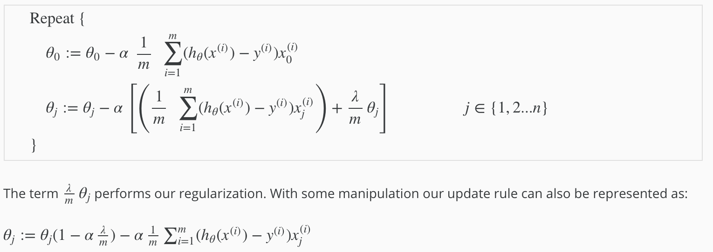

Normal Equation:
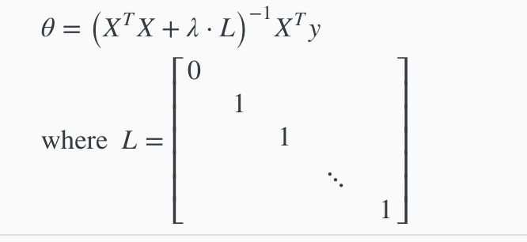

### Logistic

Cost Function:
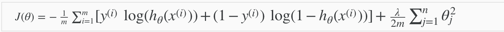

Gradient Descent:
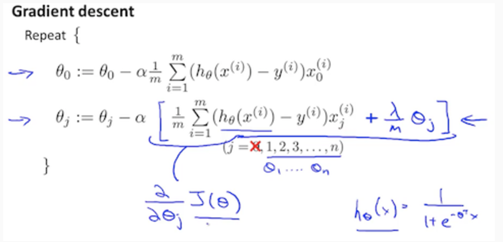

# Neural Networks
Flow:
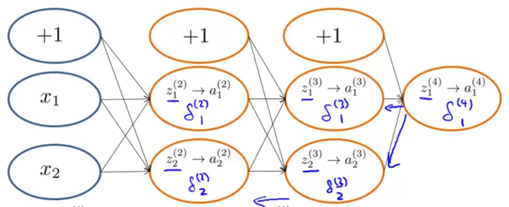
Theta:
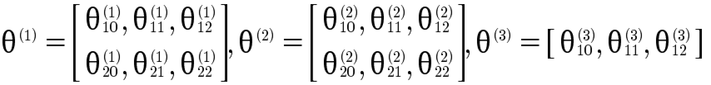
Flow:
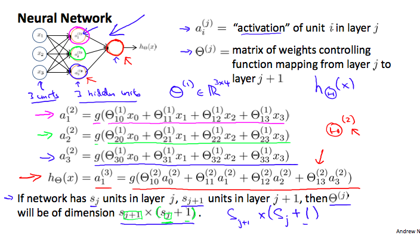
Theta:
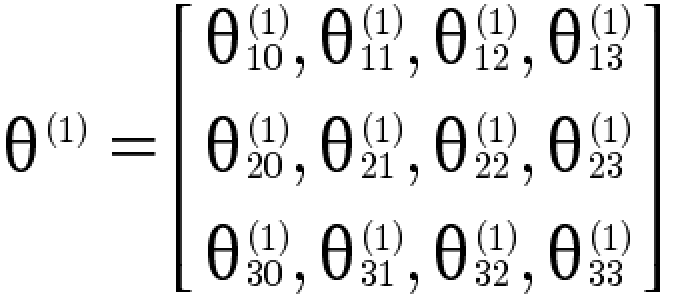

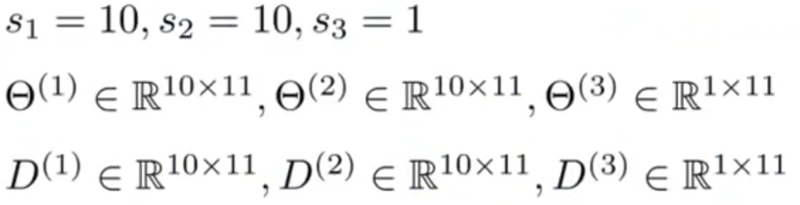

# Unsupervised Learning
Unsupervised learning allows us to approach problems with little or no idea what our results should look like


